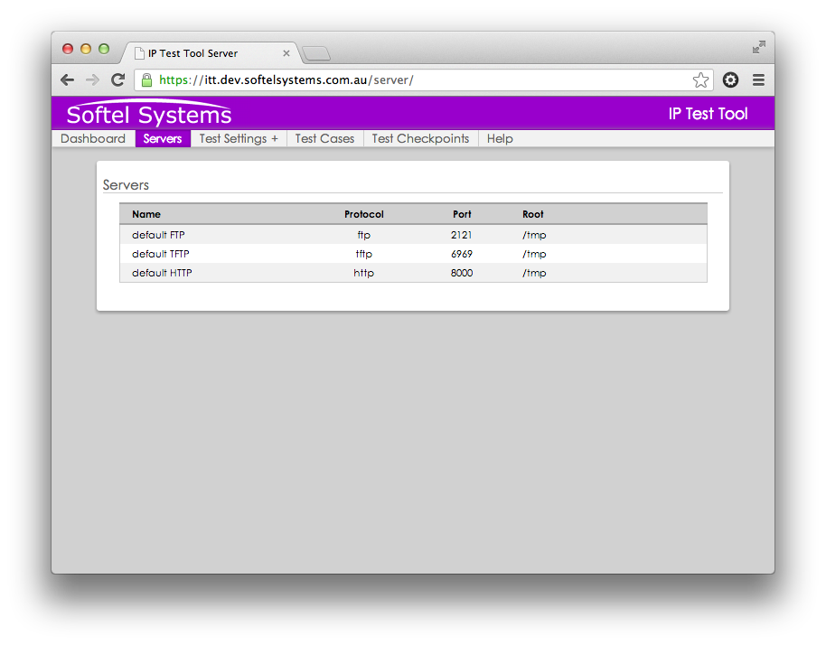

.. IP Test Tool documentation master file, created by
   sphinx-quickstart on Wed Apr  3 20:02:14 2013.
   You can adapt this file completely to your liking, but it should at least
   contain the root `toctree` directive.

.. toctree::
   :maxdepth: 2

IP Test Tool
============
.. note::
    Updated 15 May 2013 -- Sprint 4

    Sprint 4 introduces the ITT Test Case component workflows.

Workflow
^^^^^^^^
.. note::
    Workflow items will evolve and become further defined as project matures

Installation
------------

* ITT is installed

Management
----------

* Start the ITT Console

* Login as the default admin user (admin:admin)

ITT Instance Configuration
--------------------------

* ITT node configuration.  Will it be:

  * Client and/or Server

  * Standalone

  * Master or Slave

* ITT server control.  If the node is acting as a server:

  * Start select servers

ITT Test Cases
--------------

* ITT test configuration

  * Prepare test cases or use defaults 

ITT Client
----------

* Select tests

* Run tests

* Monitor progress (via checkpoint events)

* Intercept

* Analyse

* Report

Package Installation
^^^^^^^^^^^^^^^^^^^^

.. note::

    TODO: detail the ITT instance package installation

Control and Command
^^^^^^^^^^^^^^^^^^^
Each ITT installation will have a Control and Command page that can be used
to control the behaviour of the ITT instance.  The various modes of
operation include:

* **Standalone:**
  The ITT instance is self contained and does not require network access
  to function.  Useful for testing and diagnostics

* **Client:**
  Instance acts as a *client* resource during the test

* **Server:**
  Instance acts as a *server* resource during the test

* **Role:**

  * **Slave:**
    The instance is an active participant in the test (either client or
    server) and generates and stores test events.  A ITT system
    configuration could have zero or more *slaves*

  * **Master:**
    The instance is a passive participant in the test and captures all
    test events generated by the *slave* instances.  An ITT system
    configuration can have at most one *master*

ITT Sample System-wide Configuration
------------------------------------
The following diagram and descriptions demonstrate a sample ITT
configuration in the field:

.. image:: _static/itt_control.png
    :alt: IP Test Tool System Configuration
    :align: center

* **ITT01** (Standalone)

    The client and server resources are local to the ITT instance and
    interact via the system's loopback address (127.0.0.1).  No network
    access is required for this ITT instance to function.  Test events
    from the client and server resources are still generated and stored
    locally.

.. note::
    Standalone test events will not be sent to the master instance.

* **ITT02** (Designated client-only slave system)

    ITT instance isolates client-only test interaction.  As a slave system,
    the configuration implies network connectivity to initiate
    communication with remote servers.  Test events are stored locally and
    periodocally synced with a remote, master ITT instance.

* **ITT03** (Client/Server slave system)

    ITT instance can behave as either a client or server.  Usual traits of
    a slave system apply.

* **ITT04** (Designated server-only slave system)

    ITT instance isolates server-only test interatcion.  Usual traits of
    a slave system apply..

* **ITT05** (Master)

    ITT system presents an Internet-facing interface that consumes remote
    ITT test events.  The master ITT instance acts as a mediator
    between all ITT instance test events and the Analyser system.  At any
    one time, the master system will contain a snapshot of all test
    activity that has occured across the ITT instances in the field.

IP Test Tool Instance Configuration
-----------------------------------

One of the first actions required by an operator post-install is to
configure the behaviour of the ITT instance.  By default, the ITT instance
is configured as follows:

* ITT is **standalone** -- True
* **Client** enabled -- True
* **Server** enabled -- True
* **Role** -- Slave

.. note::
  Support for admin login yet to be enabled.

The ITT Control and Command login can be accessed at::

   http://<hostname>:8080/login

The default credentials for initial login are:

* **Username:** admin

* **Password:** admin

ITT instance configuration adjustments can be made at::

    http://<hostname>:8080/config

The following image shows a screenshot of the ITT Control and Command page:

.. image:: _static/itt_config_view.png
    :alt: IP Test Tool Config menu item
    :align: center
    :scale: 75%

Settings Header Fields
......................

**Config**

* Configuration settings that control the behavior of the current ITT
  instance

**Servers**

* List of supported ITT servers and their settings (currently FTP, TFTP
  and HTTP)

**Tests**

* Test configurations (available sprint 4)

**Clients**

* Interface to the ITT client that executes tests *(available sprint 4)*

**Checkpoints**

* Test events used to gauge test progress and feed into the analyser
  *(available sprint 4)*

Servers Header Fields
.....................
.. note::
    **Servers** view is only displayed if the ITT instance is configured
    with Server support.

The **Servers** section of the Config page is a convenience view that allows
management of the local ITT server resources.

Servers
^^^^^^^

The Servers page is accessible via::

        http://<hostname>:8080/server/

Each ITT installation supports FTP, TFTP and HTTP server protocols.
ITT can run a default instance of each server with preconfigured
settings.  This screen presents the details around these defaults.

Test Settings
^^^^^^^^^^^^^

In general, an ITT client can be invoked with a predefined ITT Test Case
whose settings are defined under the **Test Settings** menu option.

The **Test Settings** link is an expandable menu option that groups the Test
Case components.

Test Configurations
-------------------

A **Test Configuration** relate to the way the ITT Client transfers its
content:

* **Minimum Gap**

    Defines the minimum gap between chunks of data, in seconds.
    Only valid if chunk_size is not ``None``.

* **Chunk Size**

    Defines the amount of data that will be sent 'at full speed',
    before having an optional gap (as defined by *minimum_gap*).

Test Content
------------

The actual content that is transfered durint the test.  Content can be
prepared for the ITT Client and ITT Server (ITT Server content yet to be
enabled)

* **Static**

    Defines the nature in which the content is generated.  If ``True``,
    the content is taken from a static source and guarantees consistency
    across invocations.  If ``False``, the content is generated randomly.

* **Bytes**

    Defines the size of the content in bytes.

  .. note:: Only valid for random data (that is, if **Filename** is not
    defined).

Test Connections
----------------

* **Hostname**

* **Port**

* **Protocol**

    Must be one of *http*, *ftp*, or *tftp*.

Test Checkpoints
^^^^^^^^^^^^^^^^

**Test Checkpoints** are predefined events which register a message to
the local instance ITT Control and Command.  By default, the ITT Client
and Server instances will register a message at the start of a test transfer
and at the end of a test transfer.

Periodically, the checkpoints are sent to the Master ITT Control and
Command.  At any time, the Master instance will feature a snapshot of the
various test invocations of ITT instances in the field.

Test Checkpoints serve as a test progress indicator and also form the source
data for the downstream ITT Analyser.

Test Checkpoints Search
-----------------------

Due to the anticipated high volume of Test Checkpoints generated per ITT
instance, the **Test Checkpoints** view features a search page that filters
Checkpoints on Node (ITT instance) names.

  .. note::

    Date based search filtering to be provided at a later date.

Test Checkpoints Results
------------------------

